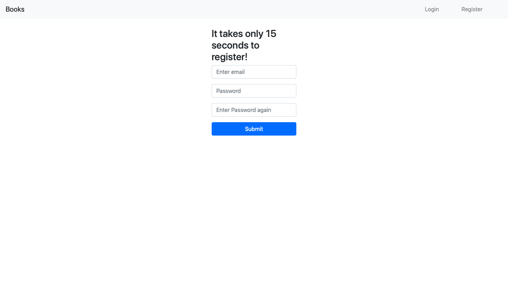
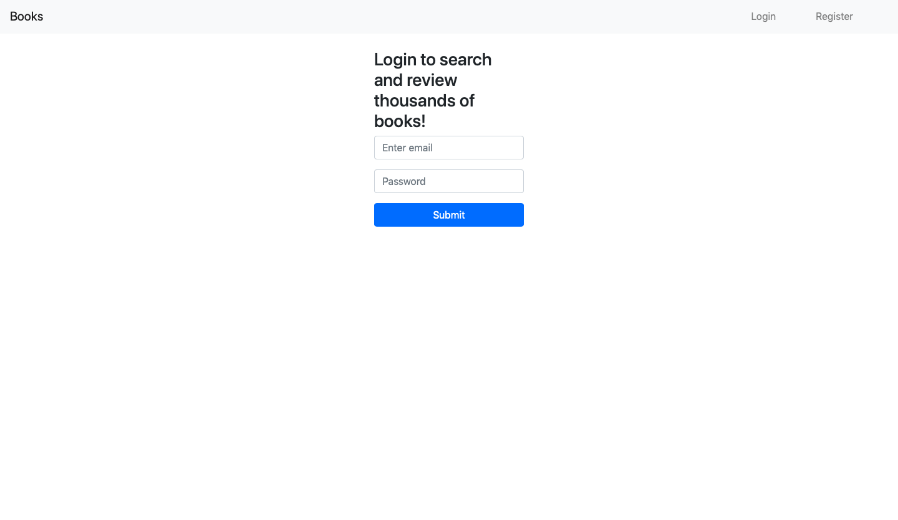
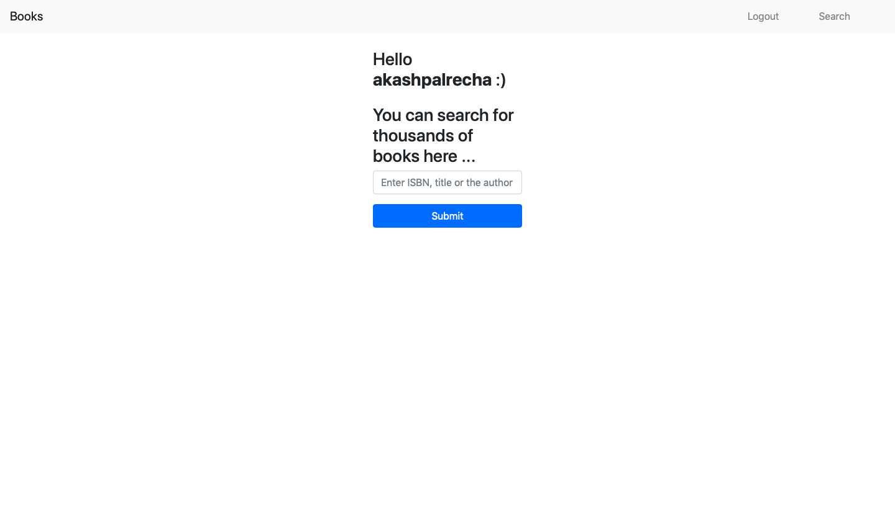
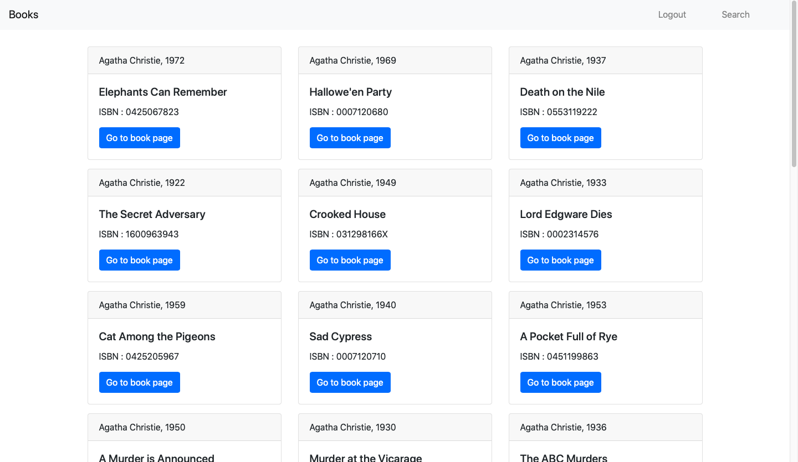
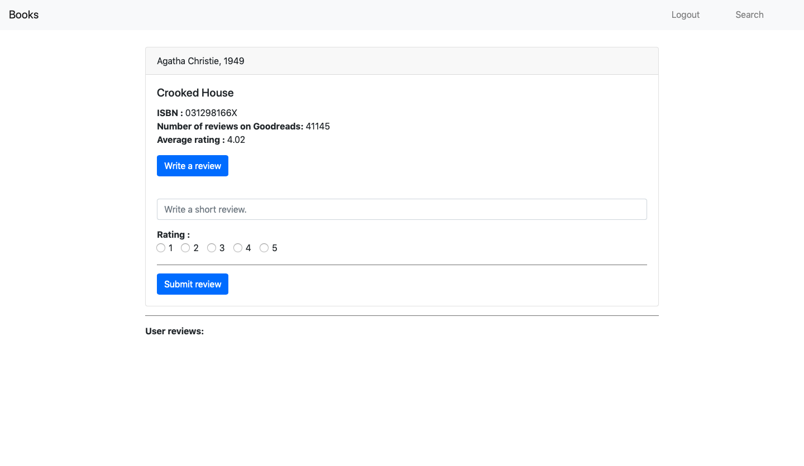
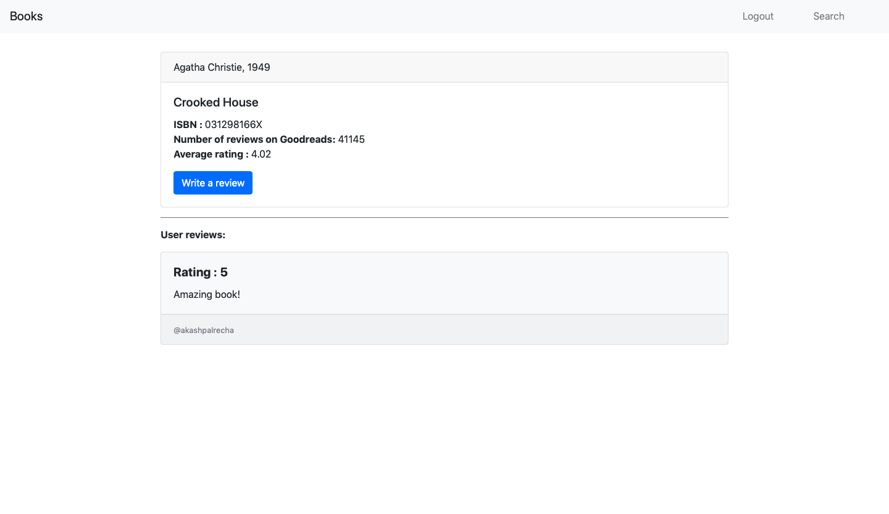

# Find and review books

See it in action: https://boiling-gorge-23297.herokuapp.com

This is a small, very minimal flask-powered webapp that allows the user to register, login, and search and review thousands of books.
I'm a deep learning enthusiast and felt that I needed some basic knowledge about how the web works- it's a very important technology to ignore in my opinion. **So I decided to take up this course called 'CS50's Web Programming with Python and JavaScript' on edX. This project is the assignment for week 3 of the course.**

To run the app locally, follow these instructions:
```
git clone https://github.com/akashpalrecha/books-reviews-website.git
cd books-review-website
pip install -r requirements.txt
bash run_local.sh
```

The repository is ready to be uploaded to heroku as a webapp just as is.
If you make any changes to the underlying implementation, be sure to change `run_app.sh` to reflect the changes in how the app will be run.


## Here are some screenshots showing the functionality of the app:

### Registeration page:


### Login page:


### Home page:


### Search results:


### Book viewer:


### Reviews:

